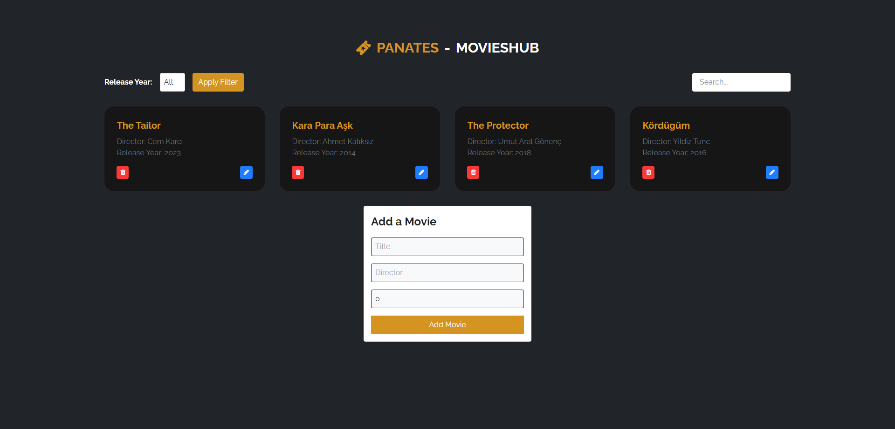

# PANATES - MOVIESHUB



## Description

"PANATES - MOVIESHUB" is a web application built using Angular. It provides a platform for users to explore and discover information about movies.

## Features

- [ ] Search for movies by title, genre, or keywords.
- [ ] Browse a curated list of popular movies.
- [ ] View detailed information about each movie, including cast, crew, and reviews.
- [ ] Save your favorite movies to a watchlist.
- [ ] Rate and review movies you've watched.

## Technologies Used

- Angular
- TypeScript
- RxJS
- Tailwind CSS
- Font Awesome
- Jasmine and Karma for testing

## Getting Started

To run this project locally, follow these steps:

1. Clone the repository: `git clone <repository-url>`
2. Navigate to the project directory: `cd movie-list-app`
3. Install dependencies: `npm install`
4. Start the development server: `npm start`
5. Open your browser and visit: `http://localhost:4200`
## Configuration

To set up the project, you'll need to configure the following:

- API keys: Obtain API keys for [Service X](link) and add them to the `.env` file.

## Deployment

To deploy the application to production, follow these steps:

1. Set the production environment variables.
2. Build the project using `ng build --prod`.
3. Deploy the generated `dist` folder to your hosting provider.

## Main Dependencies

- **Angular** (version ^16.1.0): A powerful framework for building web applications.
- **RxJS** (version ~7.8.0): Reactive Extensions for JavaScript for handling asynchronous operations.
- **Tailwind CSS** (version ^3.3.3): A utility-first CSS framework for styling.
- **Font Awesome** (version ^4.7.0): A library for scalable vector icons.
- **TypeScript** (version ~5.1.3): A typed superset of JavaScript that compiles to plain JavaScript.
- **Jasmine** (version ~4.6.0): A testing framework for JavaScript.
- **Karma** (version ~6.4.0): A test runner for JavaScript and TypeScript.
- **PostCSS** (version ^8.4.28): A tool for transforming styles with JS plugins.
- **Autoprefixer** (version ^10.4.15): A PostCSS plugin for adding vendor prefixes.
- **zone.js** (version ~0.13.0): A library that provides execution context for JavaScript.
- **Angular CLI** (version ~16.1.7): The command-line interface for Angular.
- **Jasmine HTML Reporter** (version ~2.1.0): A Karma plugin for generating Jasmine HTML reports.
- **Karma Chrome Launcher** (version ~3.2.0): A launcher for running tests in Google Chrome.
- ...

## License

This project is licensed under the MIT License file for details.

## Testing

To run tests for this project, use the following command:

```bash
npm test

Contact
For inquiries or feedback, please contact the project maintainers:

Muhammad Shiraz
Mobile: +(92)-341-212-8554
E-mail: muhammadshiraz996@gmail.com
www.muhammadshiraz.com

Feel free to adapt and expand on these suggestions based on your project's specific needs. A well-structured README can greatly improve the accessibility and usability of your project.